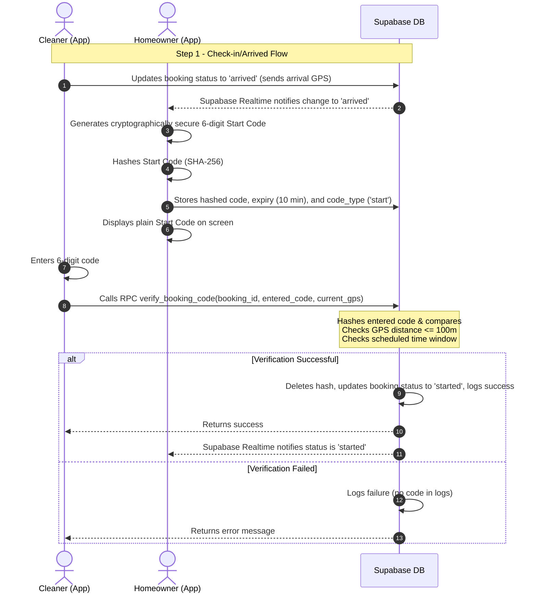

# Design Specification: Secure Two-Step Booking Verification

This document specifies the design for a secure two-step verification system for cleaning bookings using hashed one-time security codes.

## 1. Architectural Overview

The verification system ensures that:
1. The cleaner can only start cleaning after entering a valid Start Code provided by the homeowner.
2. The cleaner can only complete the cleaning after entering a valid Finish Code provided by the homeowner.
3. Cryptographically secure random 6-digit codes are generated and displayed **only** on the homeowner's device.
4. The plain codes are **never** sent to the database or stored in any logs. Only SHA-256 hashes are stored temporarily in a verification table and deleted immediately after verification or expiry.
5. All security checks (code matching, 10-minute expiry, 100-meter GPS proximity, scheduled booking window) are executed atomically in the database via a Postgres RPC function.



---

## 2. Database Schema Changes

### `booking_verification_codes` Table
Used for temporary storage of hashed codes:
```sql
CREATE TABLE IF NOT EXISTS public.booking_verification_codes (
    id UUID PRIMARY KEY DEFAULT uuid_generate_v4(),
    booking_id UUID NOT NULL REFERENCES bookings(id) ON DELETE CASCADE,
    hashed_code TEXT NOT NULL,
    expiry_time TIMESTAMP WITH TIME ZONE NOT NULL,
    code_type TEXT NOT NULL CHECK (code_type IN ('start', 'finish')),
    used BOOLEAN DEFAULT false,
    created_at TIMESTAMP WITH TIME ZONE DEFAULT NOW()
);

-- Row Level Security (RLS)
ALTER TABLE public.booking_verification_codes ENABLE ROW LEVEL SECURITY;

-- Homeowners can manage their own codes
CREATE POLICY "Homeowners manage own verification codes" ON public.booking_verification_codes
    FOR ALL
    USING (
        EXISTS (
            SELECT 1 FROM bookings b
            JOIN homeowners h ON b.homeowner_id = h.id
            WHERE b.id = booking_verification_codes.booking_id 
            AND h.user_id = auth.uid()
        )
    );
```

### Alterations to `bookings` Table
Add tracking and audit columns:
```sql
ALTER TABLE bookings 
ADD COLUMN IF NOT EXISTS check_in_time TIMESTAMP WITH TIME ZONE,
ADD COLUMN IF NOT EXISTS check_out_time TIMESTAMP WITH TIME ZONE,
ADD COLUMN IF NOT EXISTS check_in_lat DOUBLE PRECISION,
ADD COLUMN IF NOT EXISTS check_in_lng DOUBLE PRECISION,
ADD COLUMN IF NOT EXISTS check_out_lat DOUBLE PRECISION,
ADD COLUMN IF NOT EXISTS check_out_lng DOUBLE PRECISION,
ADD COLUMN IF NOT EXISTS work_duration INTEGER; -- stores duration in seconds
```

---

## 3. Database Functions (Postgres RPC)

### Distance Helper
Calculates distance in meters between coordinates using the Haversine formula:
```sql
CREATE OR REPLACE FUNCTION calculate_distance(
    lat1 double precision,
    lon1 double precision,
    lat2 double precision,
    lon2 double precision
) RETURNS double precision AS $$
DECLARE
    r double precision := 6371000; -- Earth radius in meters
    dlat double precision;
    dlon double precision;
    a double precision;
    c double precision;
BEGIN
    IF lat1 IS NULL OR lon1 IS NULL OR lat2 IS NULL OR lon2 IS NULL THEN
        RETURN 99999999;
    END IF;
    
    dlat := radians(lat2 - lat1);
    dlon := radians(lon2 - lon1);
    
    a := sin(dlat/2) * sin(dlat/2) +
         cos(radians(lat1)) * cos(radians(lat2)) *
         sin(dlon/2) * sin(dlon/2);
         
    c := 2 * atan2(sqrt(a), sqrt(1-a));
    
    RETURN r * c;
END;
$$ LANGUAGE plpgsql IMMUTABLE;
```

### Verification Function
All validation checks run inside `verify_booking_code`:
```sql
CREATE OR REPLACE FUNCTION verify_booking_code(
    p_booking_id UUID,
    p_entered_code TEXT,
    p_cleaner_lat DOUBLE PRECISION,
    p_cleaner_lng DOUBLE PRECISION
) RETURNS JSONB AS $$
DECLARE
    v_code_record RECORD;
    v_booking_record RECORD;
    v_distance DOUBLE PRECISION;
    v_entered_hash TEXT;
    v_now TIMESTAMP WITH TIME ZONE := NOW();
    v_duration INTEGER;
BEGIN
    -- 1. Compute the SHA-256 hash of the entered code
    v_entered_hash := encode(digest(p_entered_code, 'sha256'), 'hex');

    -- 2. Find the active code for the booking
    SELECT * INTO v_code_record 
    FROM booking_verification_codes
    WHERE booking_id = p_booking_id
      AND hashed_code = v_entered_hash
      AND used = false;

    -- If no code matches the hash
    IF v_code_record IS NULL THEN
        INSERT INTO activity_logs (user_id, action, entity_type, entity_id, metadata)
        VALUES (
            auth.uid(), 
            'verification_failed', 
            'booking', 
            p_booking_id, 
            jsonb_build_object(
                'error', 'Invalid security code',
                'gps', jsonb_build_object('lat', p_cleaner_lat, 'lng', p_cleaner_lng)
            )
        );
        RETURN jsonb_build_object('success', false, 'message', 'Invalid security code.');
    END IF;

    -- 3. Check expiration
    IF v_code_record.expiry_time < v_now THEN
        DELETE FROM booking_verification_codes WHERE id = v_code_record.id;
        
        INSERT INTO activity_logs (user_id, action, entity_type, entity_id, metadata)
        VALUES (auth.uid(), 'verification_failed', 'booking', p_booking_id, 
            jsonb_build_object('error', 'Code expired', 'type', v_code_record.code_type));
            
        RETURN jsonb_build_object('success', false, 'message', 'The code has expired.');
    END IF;

    -- 4. Get booking details
    SELECT * INTO v_booking_record FROM bookings WHERE id = p_booking_id;

    -- 5. Distance check (100 meters limit)
    v_distance := calculate_distance(
        v_booking_record.latitude, v_booking_record.longitude,
        p_cleaner_lat, p_cleaner_lng
    );

    IF v_distance > 100 THEN
        INSERT INTO activity_logs (user_id, action, entity_type, entity_id, metadata)
        VALUES (auth.uid(), 'verification_failed', 'booking', p_booking_id, 
            jsonb_build_object(
                'error', 'Distance limit exceeded',
                'distance_meters', v_distance,
                'type', v_code_record.code_type,
                'gps', jsonb_build_object('lat', p_cleaner_lat, 'lng', p_cleaner_lng)
            )
        );
        RETURN jsonb_build_object('success', false, 'message', 'You must be within 100 meters of the booking location.');
    END IF;

    -- 6. Code type specific checks and updates
    IF v_code_record.code_type = 'start' THEN
        -- Verify booking window (allows checking in from 1 hour before scheduled time)
        IF v_now < (v_booking_record.service_date + v_booking_record.service_time) - INTERVAL '1 hour' OR
           v_now > (v_booking_record.service_date + v_booking_record.service_time) + (v_booking_record.hours * INTERVAL '1 hour') + INTERVAL '2 hours' THEN
            
            INSERT INTO activity_logs (user_id, action, entity_type, entity_id, metadata)
            VALUES (auth.uid(), 'verification_failed', 'booking', p_booking_id, 
                jsonb_build_object('error', 'Outside scheduled window', 'type', 'start'));
                
            RETURN jsonb_build_object('success', false, 'message', 'You can only start within the scheduled booking window.');
        END IF;

        -- Update booking status to started
        UPDATE bookings 
        SET status = 'started',
            check_in_time = v_now,
            check_in_lat = p_cleaner_lat,
            check_in_lng = p_cleaner_lng,
            updated_at = v_now
        WHERE id = p_booking_id;

    ELSIF v_code_record.code_type = 'finish' THEN
        v_duration := EXTRACT(EPOCH FROM (v_now - v_booking_record.check_in_time))::INTEGER;

        UPDATE bookings 
        SET status = 'completed',
            check_out_time = v_now,
            check_out_lat = p_cleaner_lat,
            check_out_lng = p_cleaner_lng,
            work_duration = v_duration,
            updated_at = v_now
        WHERE id = p_booking_id;
    END IF;

    -- 7. Delete the verified code
    DELETE FROM booking_verification_codes WHERE id = v_code_record.id;

    -- 8. Write successful audit log (strictly metadata, no codes)
    INSERT INTO activity_logs (user_id, action, entity_type, entity_id, metadata)
    VALUES (
        auth.uid(), 
        'verification_success', 
        'booking', 
        p_booking_id, 
        jsonb_build_object(
            'type', v_code_record.code_type,
            'gps', jsonb_build_object('lat', p_cleaner_lat, 'lng', p_cleaner_lng),
            'duration_seconds', v_duration
        )
    );

    RETURN jsonb_build_object('success', true, 'message', 'Verification successful.');
END;
$$ LANGUAGE plpgsql SECURITY DEFINER;
```

---

## 4. Frontend Flow & Implementation Detail

### State Machine for Booking Status
We introduce intermediate statuses to manage the verification state machine:
* `accepted`: Booking scheduled. Cleaner is on the way.
* `arrived`: Cleaner arrived at location, homeowner displays Start Code, cleaner entering it.
* `started`: Verification succeeded, cleaning is active, work timer running.
* `finishing`: Cleaner clicked Finish, homeowner displays Finish Code, cleaner entering it.
* `completed`: Verification succeeded, job done, feedback/payment unlocked.

### Homeowner Client Implementation
When a homeowner views their bookings (`BookingHistory.jsx`):
* **Realtime Listener**: Listens to changes on `bookings` table.
* When booking status is `arrived` or `finishing`:
  * Check if there is an active code in `booking_verification_codes` for this booking and type.
  * If none exists, generate a cryptographically secure 6-digit code:
    ```javascript
    function generateSecureCode() {
      const array = new Uint32Array(1);
      window.crypto.getRandomValues(array);
      return String(array[0] % 1000000).padStart(6, '0');
    }
    ```
  * Immediately hash it using SHA-256:
    ```javascript
    async function hashSHA256(text) {
      const msgBuffer = new TextEncoder().encode(text);
      const hashBuffer = await crypto.subtle.digest('SHA-256', msgBuffer);
      const hashArray = Array.from(new Uint8Array(hashBuffer));
      return hashArray.map(b => b.toString(16).padStart(2, '0')).join('');
    }
    ```
  * Save the hashed value to the database:
    * `booking_id`: `booking.id`
    * `hashed_code`: `hashed`
    * `expiry_time`: `NOW + 10 minutes`
    * `code_type`: `'start'` (for `arrived` status) or `'finish'` (for `finishing` status)
  * Display the plain code on the UI with a 10-minute countdown timer.
  * Show a manual **"Regenerate Code"** button, which generates a new code, replaces/deletes the old hash in the database, and restarts the 10-minute timer.

### Cleaner Client Implementation
When a cleaner views their active jobs (`UpcomingJobs.jsx`):
* **Arrived Action**: When the cleaner taps "Arrived" on an `accepted` job:
  * Get the cleaner's current GPS location (`navigator.geolocation.getCurrentPosition`).
  * If successful, update the booking status in the DB to `arrived`.
  * Open the code verification modal requesting the Start Code.
* **Finishing Action**: When the cleaner taps "Finish Cleaning" on a `started` job:
  * Update the booking status to `finishing`.
  * Open the code verification modal requesting the Finish Code.
* **Submitting Verification**:
  * Cleaner enters the 6-digit code.
  * App gets current GPS coordinates.
  * App invokes Supabase RPC `verify_booking_code` with coordinates and entered code.
  * On success: modal closes, toast alert displays success, and UI automatically updates because of the state change.
  * On error: display error message.
* **Requesting Regeneration**: If the code fails or is expired:
  * Cleaner can tap a **"Request New Code"** button. This resets the status of the booking slightly or notifies the homeowner. It forces the homeowner app to regenerate the code.
